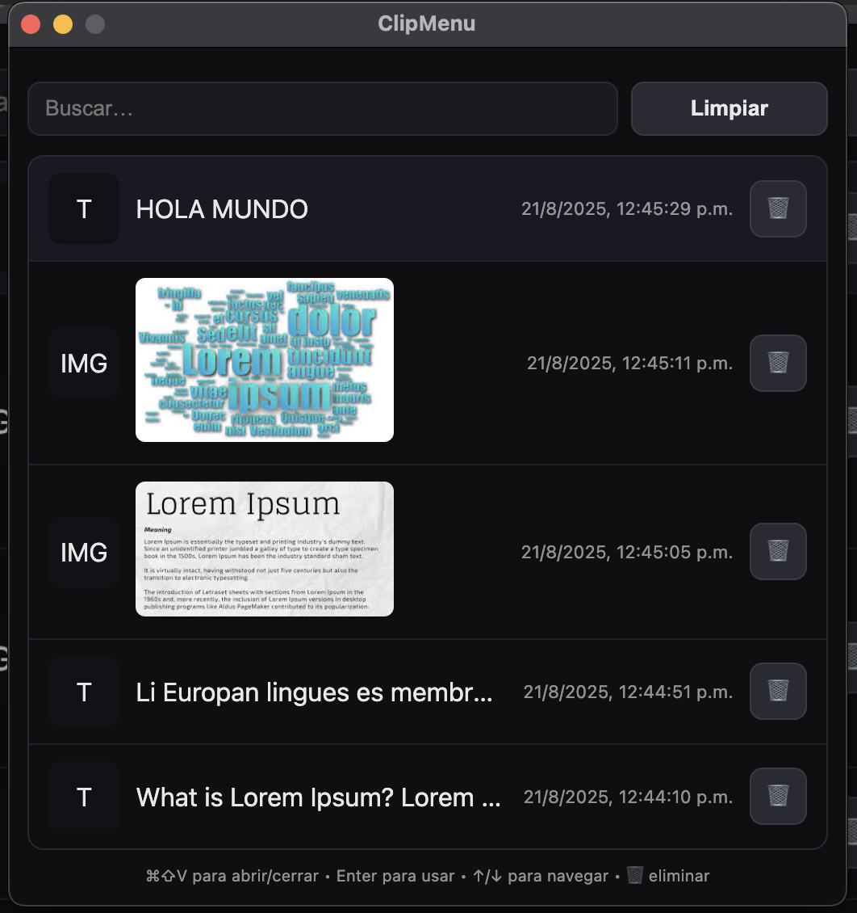
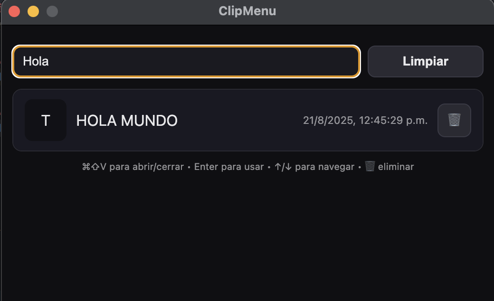
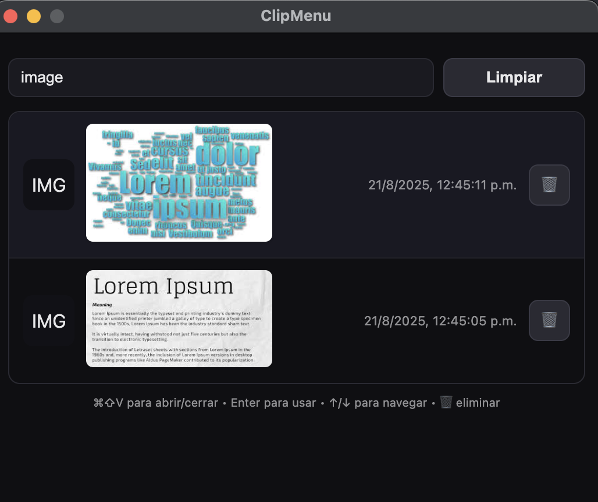
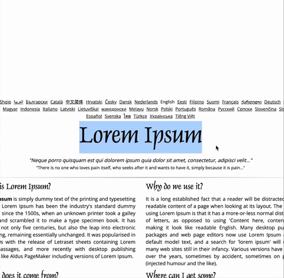

# ClipMenu – Clipboard Manager para macOS

[](https://github.com/wandergdev/clipmenu/releases)
[](LICENSE)

**ClipMenu** es un gestor de portapapeles (clipboard manager) para macOS desarrollado con [Electron](https://www.electronjs.org/).  
Funciona de forma similar a la función `Win + V` de Windows: guarda automáticamente texto e imágenes que copies, y te permite reutilizarlos rápidamente desde un historial accesible con un atajo de teclado.

---

## 📸 Capturas de pantalla

### Vista General del Clipboard


### Vista por filtrado



## 📸 Demo


---

## ✨ Funcionalidades destacadas

- 📋 Guarda automáticamente texto e imágenes del portapapeles.
- 🔍 Historial rápido accesible con `⌘ + ⇧ + V`.
- 🖼️ Miniaturas grandes para previsualizar imágenes copiadas.
- ⌨️ Pega automáticamente al seleccionar un item.
- 🗑️ Limpieza automática de items antiguos (mayores a 2 días).
- 🚀 Siempre disponible en la barra de menú de macOS.
- 💾 Persistencia: historial y archivos se guardan en `~/Library/Application Support/ClipMenu`.

---

## 📥 Descarga

Descarga la última versión de ClipMenu para macOS:

- [DMG – Instalador macOS](https://github.com/wandergdev/ClipMenu/releases/download/v0.1.0/ClipMenu-0.1.0-arm64.dmg)
- [ZIP – Versión portable](https://github.com/wandergdev/ClipMenu/releases/download/v0.1.0/ClipMenu-0.1.0-arm64-mac.zip)
---

## 📦 Instalación para desarrolladores

Si quieres probar o contribuir al proyecto:

1. Clona el repositorio:
   
   ```bash
   git clone https://github.com/wandergdev/clipmenu.git
   cd clipmenu
   ```

2. Instala dependencias:
   
   ```bash
   npm install
   ```

3. Ejecuta en modo desarrollo:
   
   ```bash
   npm start
   ```

---

## 📂 Estructura del proyecto

```
clipmenu/
 ├── main.js         # Proceso principal de Electron
 ├── preload.js      # Comunicación segura entre main y renderer
 ├── renderer/       # Interfaz de usuario
 │   ├── index.html
 │   └── renderer.js
 ├── package.json
 └── README.md
```

---

## 🤝 Contribuciones

¡Contribuciones son bienvenidas!  
Si quieres mejorar ClipMenu, abre un *issue* o envía un *pull request*.

---

## 📜 Licencia

Este proyecto está licenciado bajo la licencia MIT.  
Consulta el archivo [LICENSE](LICENSE) para más información.

---

## 📝 Notas

- Compatibilidad: macOS 10.15 o superior  
- Requerimientos: Node.js y npm
